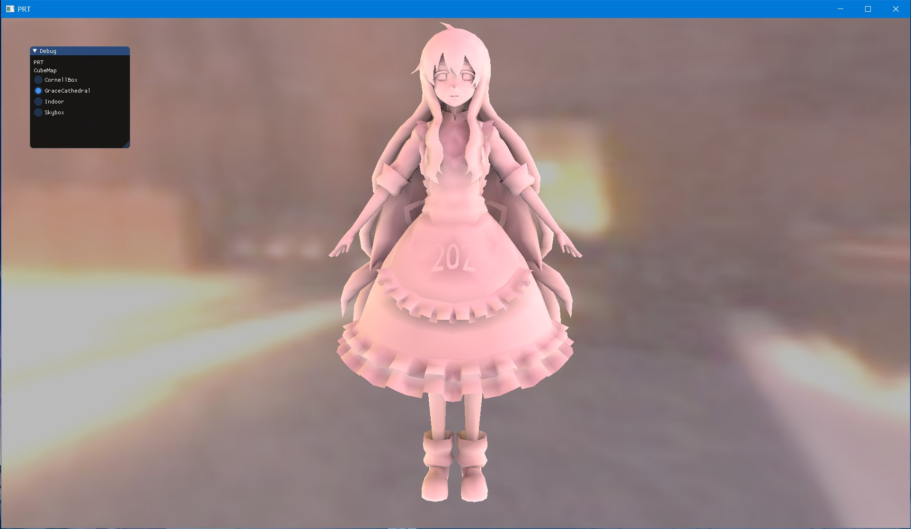
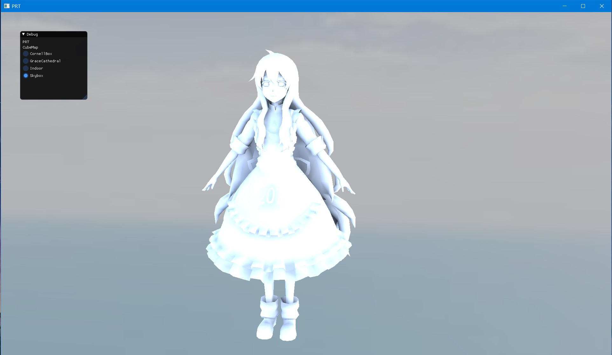
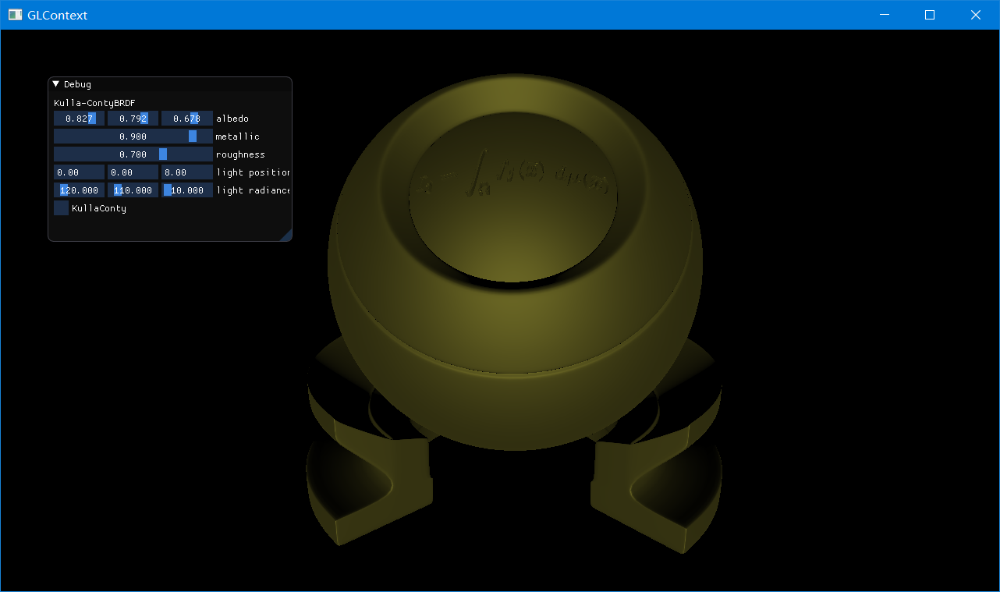
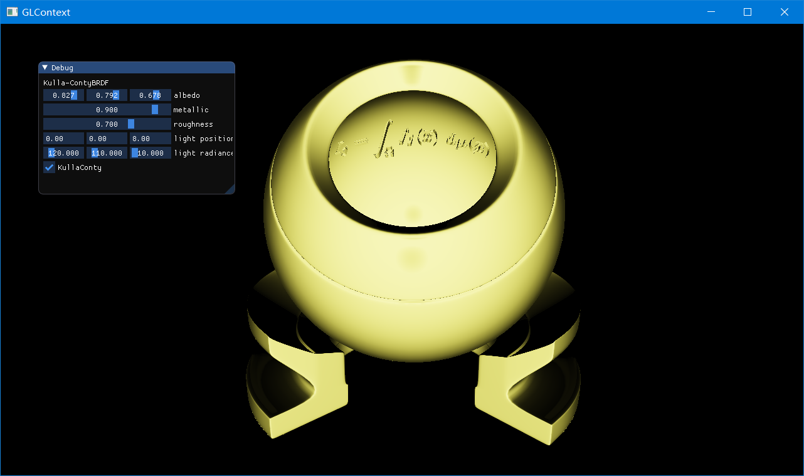
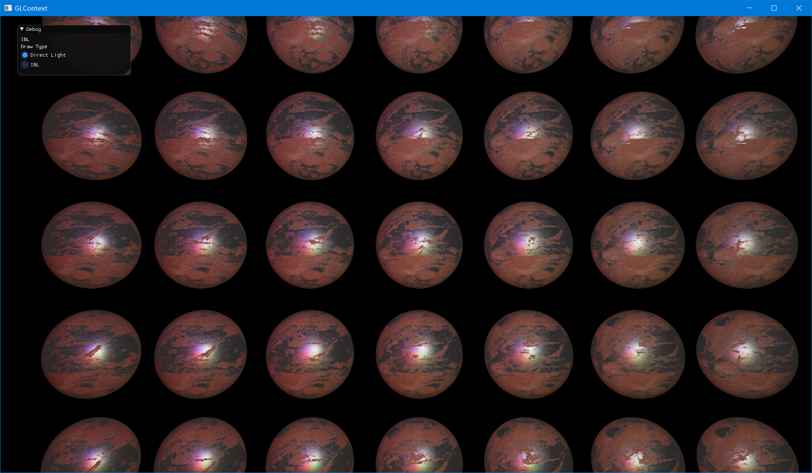
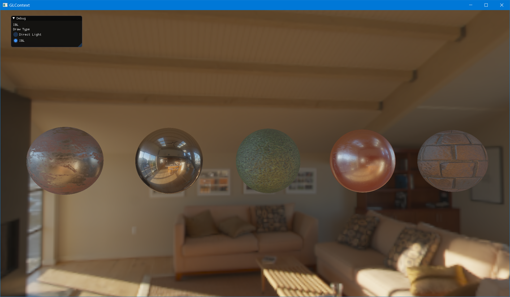
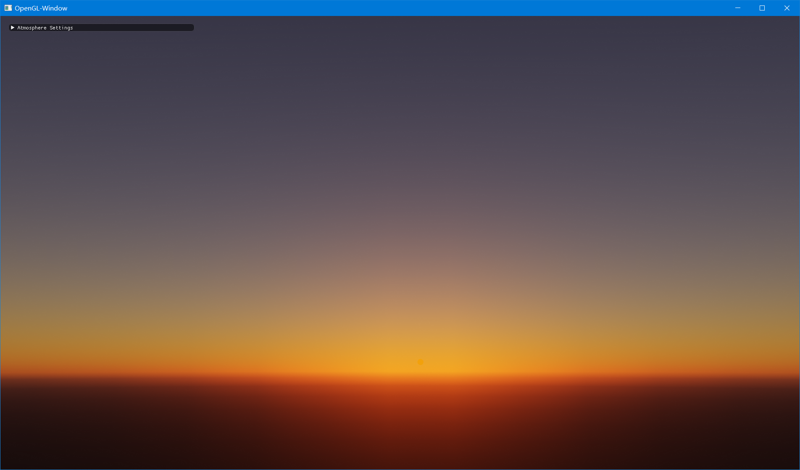
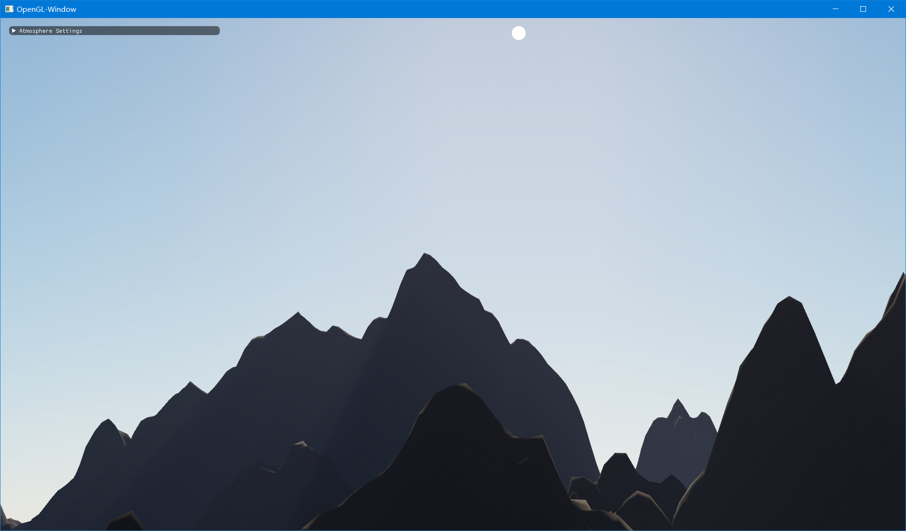
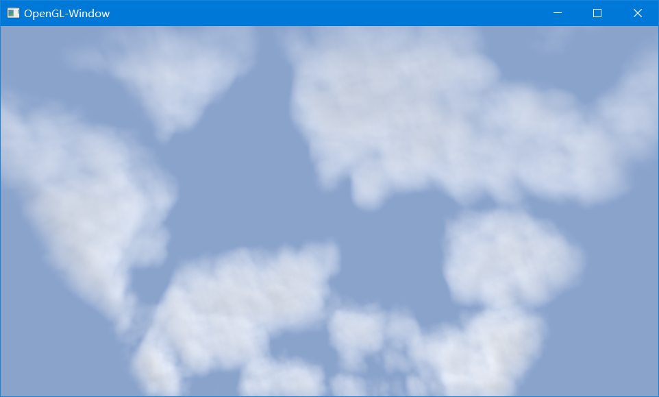

# OpenGL Samples
使用OpenGL快速实现的一些算法，主要是学习目的，代码质量比较差
## Games202-OpenGL
这个版本实现的不完整，最新的可参考[这个仓库](https://github.com/wyzwzz/Games202-OpenGL)
### **1.ShadowMap**

### **2.PRT**

### **3.SSRT**

### **4.Kulla-ContyBRDF**

### **5.RTRTDenoiser**

### **IBL**

### **Atmosphere**

### **Volumetric Cloud**

